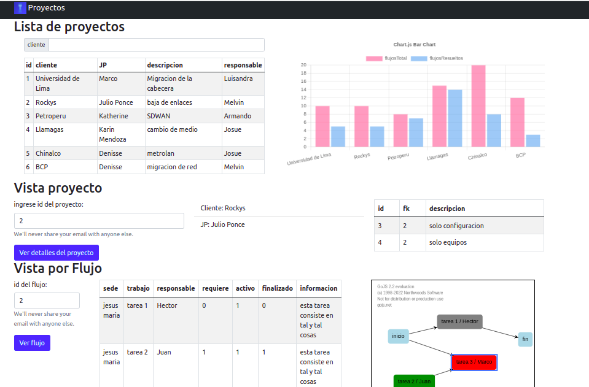

# - __Alcance del proyecto__
El proyecto consiste en desarrollar una plataforma web para la gestion de proyectos de red (ISO layer 1,2 y 3) con el framework django. El nombre del proyecto es: _Plataforma para la Gestion de Proyectos de Red._



# - __Entregable__
- Software funcional subido en Github: Este es el link https://github.com/josueelias9/network-project-manager-for-Telefonica
- Guía bien detallada del funcionamiento: En la seccion **Documentos** se explica como esta organizada toda la doucmentaicon.
# - __estructura de folder__
Estructura del proyecto:
```
|-- network-project-manager-for-Telefonica (repositorio)
    |-- backend
    |-- frontend
    |-- documentacion (documentacion)
    |-- README.md (documentacion)
    |-- proyecto.png (imagen referencial del proyecto)
    |-- idea en desarrollo.txt (obviar)
    |-- packet tracert redes (diseños de red)
    |-- proyecto (codigo)
        |-- query.sql (para llenar base de datos)
        |-- requirements.txt (instalar)
        |-- mysite (codigo)
            |-- mysite (codigo)
                |-- settings.py (ahi que configurar el DB aqui)
        |-- env (esto lo instalas tu. Esta en los pasos)
```
# - __¿Como hacer funcionar el programa?__
- descargar repositorio
- Crear entorno virtual llamado _env_
```bash
cd (ruta)/network-project-manager-for-Telefonica/backend
python3 -m venv env
```
- ejecutar el siguiente comando para activar el venv del proyecto

```bash
source (ruta)/network-project-manager-for-Telefonica/backend/env/bin/activate
```
- ejecute los requirements dentro del venv activado para que se instalen las dependencias

```bash
cd (ruta)/network-project-manager-for-Telefonica/backend
pip3 install -r requirements.txt
```

- ahora vamos a prepara la base de datos. Ejecutar los siguientes comandos para poder crear la base de datos. 
```bash
python3 manage.py makemigrations tdp
python3 manage.py migrate
```
- luego crear super user
  - user: admin
  - email: admin@admin.admin
  - password: admin

- ejecutar el siguiente comando para poder popula la base de datos con datos iniciales.
```bash
python3 manage.py makemigrations --empty tdp 
```
- Dentro de la carpeta _migrations_ se creara un archivo. Copie segun corresponda el codigo que se encuentra en el archivo _inicializar_modelo.py_ en este file. Luego ejecutar el siguiente comando y vera como se "popula" la base de datos.
```bash
python3 manage.py migrate
```
- inicie el servidor
```bash
cd (ruta)/network-project-manager-for-Telefonica/backend
python3 manage.py runserver
```
- puede inspeccionar el API del backend desde la siguiente ruta
```url
http://127.0.0.1:8000/polls/personaDetail/
```
- ahora instale las dependencias del frontend e inicielo
```bash
cd (ruta)/network-project-manager-for-Telefonica/frontend
npm install
npm start
```
listo
## -- Base de datos (revisar)
### --- *Crea tu base de datos*
crea tu base de datos con _MySQL Workbench_
### --- *Enlaza tu base de datos con el protecto*
tener en cuenta que en _setting.py_, tendras que poner los datos que correspondan segun tu base de datos:
- _django_db_: es el nombre de la base de datos que tu creas
- _root_: cuando entras a mysql workbench tienes que entrar con un usuario y contraseña. Aqui se pone el nombre del usuario
- _123456_: contraseña para entrar a workbench
```python
DATABASES = {
    'default': {
        'ENGINE': 'django.db.backends.mysql',
        'NAME': 'django_db',
        'USER': 'root', 
        'PASSWORD': '123456',
        'HOST': 'localhost',
        'PORT': '3306',
        'OPTIONS':{
            'init_command': "SET sql_mode = 'STRICT_TRANS_TABLES'"
        }
    }
}
```
### --- *crea tablas en tu base de datos*

```bash
python3 manage.py makemigrations
python3 manage.py migrate
```
### --- *llena tu base de datos con infomracion*
ejecutar los comandos sql que estan descritos en el archivo _query.sql_
### --- *troubleshooting*
en caso tengas problemas con la base de datos, ir a carpeta _migrations_ y eliminarla. Luego ejecutar
```bash
python3 manage.py makemigrations
python3 manage.py migrate
```
# - __Definiciones__
- Etapa de desarrollo: todo lo que hace el desarrollador
- etapa de produccion: evaluacion del usuario

# - __Stakeholder__
- __desarrollador__: trabaja el proyecto
- __usuario__: es quien usara el proyecto

# - __Herramientas__
Lenguajes de programación: 
- Python
- JavaScript

Frameworks:
- Django
- Bootstrap 

Base de datos:
- MySQL Workwench
## -- versiones del entorno
- pip 20.0.2 
- python 3.8.10
- Ubuntu 20.04.3 LTS 64 bits
- GNOME 3.36.8
- mysql  Ver 8.0.28-0ubuntu0.20.04.3 for Linux on x86_64 ((Ubuntu))

# - __Documentación__

```
|-- network-project-manager-for-Telefonica (nombre del proyecto)
    |-- README.md (informacion macro)
    |-- idea en desarrollo.txt (en desarrollo)
    |-- packet tracert redes (carpeta con archivos PKP)
    |-- documentacion (contiene informacion acerca del proyecto)
        |-- varios.xlsx
        |-- flujos.mdj
    |-- proyecto (contiene todos los archivos de django y bootstrap)
        |-- env (esta carpeta se tiene que crear)
        |-- query.sql
        |-- requirements.txt
        |-- mysite
            |-- polls (mi aplicacion)
            |-- manage.py (archivo que levanta el servidor)
 
```

Organizacion de los archivos:
- __network-project-manager-for-Telefonica__: nombre del proyecto
  - __README.md__: informacion macro
  - __documentacion__: contiene informacion acerca del proyecto
  - __idea en desarrollo.txt__: en desarrollo
  - __packet tracert__: carpeta con archivos PKP
  - __proyecto__: contiene todos los archivos de django y bootstrap
## -- Documentacion macro
La documentacion viene por varios frentes. Hay 2 archivos que definen claramente la documentacion de este proyecto:

- diagrama de flujo del proyecto.mdj
- varios.xlsx
## -- documentacion tecnica
Dentro del codigo tambien encontraremos documentacion, pero esta se diferencia de la anterior ya que es mas detallada y tecnica

Los files python usan la siguiente convencion para los comentarios Como primer nivel: 
```python
#########################################################
# DETAIL VIEWS
#########################################################
```
y como segundo nivel:

```python
# -----------------------------
# CRUD de InterfaceGeojson
# -----------------------------
```

y los archivos HTML usan el siguinete
```html
<!-- -->
```
# - __templates__
Hablando de templates, hay tres carpetas:
- CUD: para vistas crear, update y delete
- list: para vistas list
- boostrap: para vistas detail
- principal: la vista principal del proyecto
## -- informacion acerca de los html
cada HTML tiene una relacion uno a uno con las vistas. La convencion que se uso (nos guiamos de la guia oficial de django) es poner el nombre del modelo en el nombre del HTML

|nombre template| view |
| - | -| 
| “modelo”_confirm_delete.html | DeleteView |
| “modelo”_form.html           | CreateView |
| “modelo”_update_form.html    | UpdateView |
| “modelo”Detail.html          | DetailView |

HTML se trata de secciones. Definimos la siguiente forma de dividir esas secciones. Nos guiamos de la siguiente referencia oficial: 

- https://getbootstrap.com/
- dar click a “Docs”
- desplegar “Utilities”
- nos guiamos de “Spacing” “Colors” y “Shadows”

con ello creamos el siguiente codigo HTML
```html
<div class="m-5">
<div class="shadow-lg p-3 mb-5 bg-secondary rounded">
<h3 class="text-white">INFORMACION</h3>
</div>
</div>

<div class="m-5">
<!-- todo el contenido que queramos -->
</div>
```

# - __modelos__
en el archivo excel hay que poner la relacion de estos modelos
- Proyecto
- Persona
- Trabajo
- Sede
- InterfaceGeojson

# - __imagenes__
se usa la siguiente convencion para nombrar las imagenes:
- capa “nombre de capa”.”extension”: no estan relacionadas a ningun modelo
- trabajo “nombre del trabajo”.”extension”: estan relacionadas al modelo Trabajo 

# - __geojson__
Geojson https://es.wikipedia.org/wiki/GeoJSON define los siguientes tipos:

- Point
- MultiPoint
- LineString
- MultiLineString
- Polygon
- MultiPolygon
- GeometryCollection

Google tiene una herramienta que permite que interactues con sus APIs. A continuacion la guia oficial:

- https://developers.google.com/
- buscar “Maps Platform” 
- ir a SDK de Maps y dar click a “JS”
- ir “Samples”
- luego a “Layers”
- finalmente “Data Layer: Styling”

Sus herramientas entiende formato gejson. Por ello tenemos que entender bien ello. A continuacion un geojson que se entrega directamente a la API de google.

Aquí un geojson que la api de google puede entender. Se ve la definicion de los tipos Point, LineString, MultiLineString y Polygon.
```json
{ "type": "FeatureCollection", "features": 
[

{ "type": "Feature", "properties": { "tipo_de_geojson": "SP", "color": "red", "informacion": "<li>-77.016231, -12.112729</li>"}, "geometry": { "type": "Point", "coordinates": [-77.016231, -12.112729] } }, 

{ "type": "Feature", "properties": { "tipo_de_geojson": "SL", "color": "red", "informacion": "String unico."}, "geometry": { "type": "LineString", "coordinates": [ [-77.0460123,-12.275521], [-76.996733, -12.100521], [-77.016231, -12.112729] ] } }, 

{ "type": "Feature", "properties": { "tipo_de_geojson": "ML", "color": "red", "informacion": "Conjunto de enlaces."}, "geometry": { "type": "MultiLineString", "coordinates": [ [[-77.018337, -12.117638], [-76.972305, -12.117778]], [[-76.996733, -12.100521], [-77.016231, -12.112729]] ] } }, 

{ "type": "Feature", "properties": { "tipo_de_geojson": "SG", "color": "blue", "informacion": "<li>area azul</li>"}, "geometry": { "type": "Polygon", "coordinates": [[ [-77.06003157186912, -12.047891015435393 ], [-77.06342697143555, -12.054597715392429 ], [-77.0597165831714, -12.066626815210839 ], [-77.07566142256837, -12.085705444766615 ], [-77.08310902380617, -12.08774594300533 ], [-77.12453746458371, -12.06777068417591 ], [-77.10223055402305, -12.02118063953637 ], [-77.07085736046696, -12.01880988728709 ], [-77.06256866455078, -12.028575662342247 ], [-77.06003157186912, -12.047891015435393 ] ]] } }, 

]
}
```
## -- dato
Tener claro que  del objeto linestring anterior, lo unico que pasamos es el "geometry". Del objeto linestring anterior,  en el atributo __juego_de_arrays__ del modelo __InterfaceGeojson__  se ingreso lo siguiente:

```json
	"geometry": { "type": "LineString", "coordinates": [ [-77.0460123,-12.275521], [-76.996733, -12.100521], [-77.016231, -12.112729] ] }
```
## -- ¿como generar coordenadas? 
- En el vide https://www.youtube.com/watch?v=PrxRJp-MZxk se explica como es que se puede hacer trazos en google maps y como exportarlos a KMZ. 
- En este link https://mygeodata.cloud/converter/kmz-to-json encontraras una herramienta para convertir un archivo KMZ a JSON.
- finalmente, una vez con el archivo descargado, copiamos las coordenas que ya se encuentran en formato json y lo enviamos a nuestro programa.

# - __Testing__
./manage.py test

---------------
# - __titulo 1__
## -- titulo 2
### --- *titulo 3*